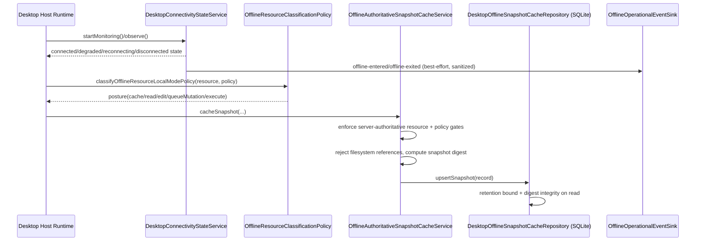
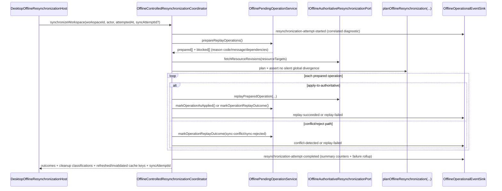
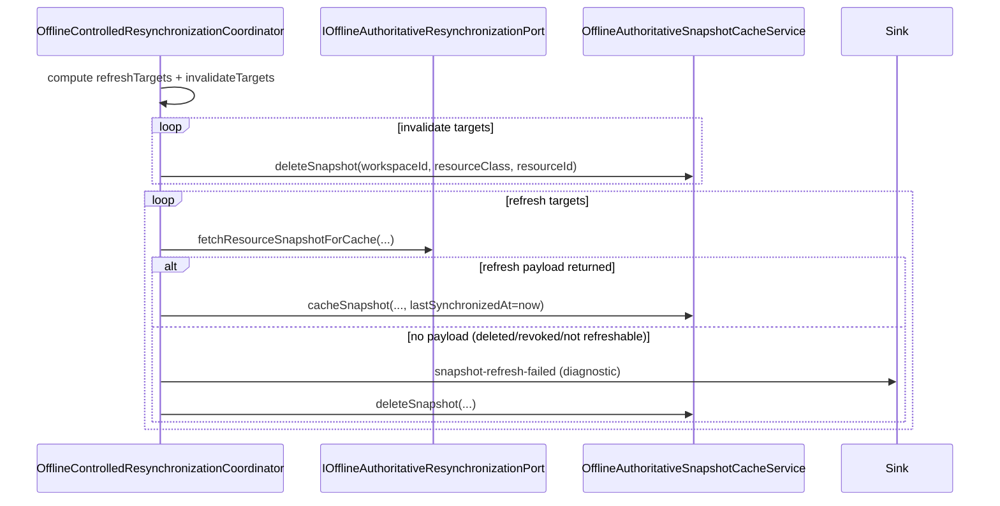

# Offline Local-Mode Authority Boundaries

Feature 19 / Epic 19.1 establishes production-grade limited local autonomy for desktop clients.

## Offline/local-mode philosophy

Offline support exists to preserve user continuity, not to create a second control plane.

Non-negotiable philosophy:
- desktop clients may continue bounded local work while disconnected;
- server state remains authoritative global truth;
- offline work must remain explicit local state until reconnect decisions are made;
- reconnect behavior must be visible and conflict-aware;
- client code must not treat offline local state as silently authoritative global truth.

## Canonical implementation seams

- domain policy and offline boundary catalog:
  - `src/domain/platform/OfflineLocalModeBoundaries.ts`
- application resynchronization policy and decision model:
  - `src/application/common/OfflineLocalModeResynchronization.ts`
- application classification seam:
  - `src/application/common/OfflineResourceClassificationPolicy.ts`
- application authoritative snapshot cache service and contracts:
  - `src/application/common/OfflineAuthoritativeSnapshotCache.ts`
- application pending-operation persistence + replay-preparation service and contracts:
  - `src/application/common/OfflinePendingOperationPersistence.ts`
- application local-execution registration persistence + replay-preparation service and contracts:
  - `src/application/common/OfflineLocalExecutionRegistrationPersistence.ts`
- application controlled resynchronization coordinator:
  - `src/application/common/OfflineControlledResynchronizationCoordinator.ts`
- application desktop startup recovery and interrupted-resync inspection/recovery service:
  - `src/application/common/OfflineDesktopStartupRecovery.ts`
- application offline audit/operational event hook contracts:
  - `src/application/common/OfflineOperationalEventPorts.ts`
- desktop host local-mode profile binding:
  - `src/hosts/desktop/DesktopOfflineLocalModeProfile.ts`
- desktop host connectivity-state monitor and transition service:
  - `src/hosts/desktop/DesktopConnectivityStateService.ts`
- desktop host cache runtime factory:
  - `src/hosts/desktop/DesktopOfflineSnapshotCacheHost.ts`
- desktop host pending-operation persistence runtime factory:
  - `src/hosts/desktop/DesktopOfflinePendingOperationHost.ts`
- desktop host local-execution registration persistence runtime factory:
  - `src/hosts/desktop/DesktopOfflineLocalExecutionRegistrationHost.ts`
- desktop host controlled resynchronization runtime factory:
  - `src/hosts/desktop/DesktopOfflineResynchronizationHost.ts`
- runtime adapter for offline hook publication into existing audit/operational streams:
  - `src/infrastructure/api/system-runtime/DesktopOfflineOperationalEventSink.ts`
- desktop offline snapshot cache persistence adapter:
  - `src/infrastructure/desktop/DesktopOfflineSnapshotCacheRepository.ts`
- desktop offline pending-operation persistence adapter:
  - `src/infrastructure/desktop/DesktopOfflinePendingOperationRepository.ts`
- desktop offline local-execution registration persistence adapter:
  - `src/infrastructure/desktop/DesktopOfflineLocalExecutionRegistrationRepository.ts`
- desktop offline interrupted-resynchronization recovery marker persistence adapter:
  - `src/infrastructure/desktop/DesktopOfflineResynchronizationRecoveryRepository.ts`
- desktop offline protected-value adapter:
  - `src/infrastructure/desktop/DesktopOfflineValueProtection.ts`
- shared contract package for runtime DTO/schema/state:
  - `src/shared/contracts/runtime/OfflineSynchronizationContracts.ts`
  - `src/shared/dto/runtime/OfflineSynchronizationDtos.ts`
  - `src/shared/schemas/runtime/OfflineSynchronizationSchemaContracts.ts`

## Authority model and storage buckets

Local state is split into explicit buckets so authority is always visible:
- `offline-cache`: read-optimized snapshots of authoritative resources;
- `local-draft-state`: explicit local authoring state;
- `mutation-queue`: pending authoritative mutation intents;
- `local-ephemeral-state`: local runtime/session activity that is never authoritative;
- `server-authoritative-only`: non-cacheable server-only material.

Authoritative snapshot cache records must include:
- workspace context (`workspaceId`) and logical resource identity (`resourceClass`, `resourceId`);
- authoritative version metadata (`authoritativeRevision`, `authoritativeSnapshotRevision`);
- sync timing metadata (`cachedAt`, `lastSynchronizedAt`, optional `expiresAt`);
- eligibility markers (`workspace visibility/role/sharing`, `sensitivity`, `storageRule`, `deviceTrustPosture`);
- authority and storage posture markers (`authorityScope`, `storageBucket`, `behaviorClass`, cache protection posture);
- logical snapshot payload + digest only (no raw file-system references).
- protected local-value posture metadata so persisted snapshot payload fields can be encrypted-at-rest when platform support is available.

Authority scopes remain explicit:
- `authoritative-server`
- `local-draft`
- `local-ephemeral`

## Allowed offline capabilities (resource eligibility baseline)

| Resource class | Behavior class | Authority scope | Cache | View | Edit | Queue | Execute | Default bucket |
|---|---|---|---|---|---|---|---|---|
| `workspace-catalog` | `cached-read-only` | `authoritative-server` | yes | yes | no | no | no | `offline-cache` |
| `workflow-definition` | `cached-read-only` | `authoritative-server` | yes | yes | no | no | no | `offline-cache` |
| `workflow-draft` | `local-draft` | `local-draft` | yes | yes | yes | yes | no | `local-draft-state` |
| `run-submission-intent` | `queued-authoritative-intent` | `authoritative-server` | yes | yes | yes | yes | no | `mutation-queue` |
| `local-runtime-session` | `local-ephemeral-execution` | `local-ephemeral` | yes | yes | yes | no | yes | `local-ephemeral-state` |
| `secret-plaintext-material` | `server-only` | `authoritative-server` | no | no | no | no | no | `server-authoritative-only` |

Unknown resource classes are denied by default (`supportedResourceClass=false`) and must be explicitly registered before they are offline-capable.

## Classification policy inputs and gates

Offline eligibility is deterministic from policy inputs:
- workspace visibility (`private`/`team`/`public`)
- workspace access role (`owner`/`admin`/`member`/`viewer`)
- sharing posture (`workspace-only`/`tenant-wide`/`external-shared`/`public-link`)
- sensitivity (`standard`/`sensitive`/`restricted`/`secret`)
- storage rule (`allow-offline-cache`/`require-encrypted-offline-cache`/`disallow-offline-cache`)
- device trust posture (`trusted`/`pending-verification`/`untrusted`/`revoked`)

Policy output is operation-level posture for `cache`, `read`, `edit`, `queueMutation`, and `execute`, with explicit allow/deny reason and exclusion reasons.

## Local draft semantics and pending-operation handling

Disconnected edits are represented as explicit local draft and queue artifacts, not in-place authoritative mutation.

Local draft seams:
- `createOfflineLocalDraftDocument(...)`
- `appendOfflineLocalDraftChange(...)`
- `transitionOfflineLocalDraftSynchronizationStatus(...)`

Queued-operation seams:
- `createOfflineQueuedMutationEnvelope(...)`
- `createOfflinePendingRunSubmissionRecord(...)`
- `createOfflinePendingOperationRecord(...)`
- `OfflinePendingOperationService.queueOperation(...)`
- `OfflinePendingOperationService.prepareReplayOperations(...)`
- `OfflinePendingOperationService.markOperationReplayOutcome(...)`

Required semantics:
- drafts carry `baseAuthoritativeRevision` and `authoritativeSnapshotRevision`;
- draft sync progression remains explicit (`local-only` -> `queued-pending-sync` -> `sync-conflict`/`sync-rejected`/`sync-applied`);
- queued operations include replay descriptor (`method`, rooted `path`, `idempotencyKey`, `payload`);
- queued operations require `divergenceDisclosureToken`;
- queued operations cannot be pre-marked `sync-applied`;
- local edits reset sync state to `local-only` and clear queued linkage.
- persisted pending-operation records include actor/workspace context, operation dependency graph, base-version metadata, retryability metadata, and canonical replay payload digest so reconnect replay is deterministic and auditable.
- replay preparation filters to replay-eligible unsynced operations and produces deterministic dependency-aware replay ordering.
- pending-operation and local-execution queue persistence protect replay/envelope JSON fields at rest when desktop protected storage is available; when unavailable, posture remains explicit as unprotected.

## Sync and reconciliation boundaries

Reconnect decisions are explicit and bounded:
1. load authoritative revision snapshots for queued targets;
2. classify each queued mutation as:
   - `apply-to-authoritative`
   - `conflict-requires-review`
   - `reject-not-allowed`
3. require visible intervention for conflict/rejection outcomes.
4. replay only eligible operations through authoritative API ports in deterministic dependency order.
5. persist explicit replay outcomes (`sync-conflict`/`sync-rejected`) and remove queue entries only after authoritative apply confirmation.
6. refresh local authoritative snapshot cache for stale cached resources and successfully replayed targets.
   - invalidate cached snapshots when authoritative revisions indicate resource deletion/revocation, replay-permission loss, or invalidated run submissions.
   - if stale cached resources cannot be refreshed after reconnect, invalidate them to avoid stale-authoritative appearance.
7. surface blocked replay operations with structured reason metadata (reason code/message/dependency blockers) instead of opaque id-only reporting.
8. treat terminal blocked replay states (`retry-exhausted`, `non-retryable`) as explicit rejected outcomes and preserve the local unsynced record for manual intervention.
9. emit explicit pending-operation cleanup classifications (`successful`, `conflicted`, `failed`, `abandoned`) with remove-vs-retain actions so post-sync local-state transitions are queryable.
10. when reconnect decisions reject replay due revocation/permission-loss classes, persist non-retryable state with explicit reason code and invalidate affected authoritative snapshot cache entries.

Enforced by:
- `planOfflineResynchronization(...)`
- `assertResynchronizationPlanPreventsSilentGlobalDivergence(...)`
- `OfflineControlledResynchronizationCoordinator.synchronizeWorkspace(...)`

## Desktop connectivity-state boundaries

Desktop host connectivity state is explicitly modeled and exposed through one host-owned state service instead of page-level heuristics.

- server reachability, trusted-session availability, trust prerequisites, and deliberate offline-mode intent are evaluated together;
- transitions are explicit across `connected`, `degraded`, `reconnecting`, and `disconnected`;
- deliberate offline mode is distinguished from transient transport failures through structured reason metadata;
- UI/shared layers consume one structured connectivity payload via the desktop host bridge rather than inferring status from ad hoc errors.

Connectivity transition publication is explicit:
- `offline-entered` and `offline-exited` events emit from the host connectivity service when local-mode state changes;
- transition events are best-effort and do not alter connectivity decision semantics.

## Desktop offline-aware UX status surfaces (Story 19.3.1)

Desktop shell UX now consumes canonical offline contract state through shared presenter/UI seams rather than route-level transport heuristics.

- desktop bridge/UI service seam:
  - `src/ui/shared/connectivity/DesktopConnectivityService.ts`
  - consumes `OfflineConnectivitySurfaceStateDto` and resolves `OfflineSynchronizationStateSnapshotDto` (bridge payload when available, canonical structured fallback otherwise).
- shared presenter seam:
  - `src/ui/presenters/DesktopOfflineStatusPresenter.ts`
  - derives banner state, reconnecting/offline/unsynced messaging, cache summaries, pending-sync summaries, and policy-limited guidance from shared offline contracts.
- shared desktop shell surface seam:
  - `src/ui/shared/connectivity/DesktopOfflineStatusSurface.tsx`
  - renders status banner, cached-resource summary, pending-operation summary, and explicit unsupported-action guidance.
- shell composition seam:
  - `src/ui/layout/AppLayout.tsx`
  - renders the offline status surface in the shared desktop frame and keeps host/sync mechanics outside the UI.

Required UX behavior baseline:
- users can distinguish `connected`, `offline`, `reconnecting`, and `connected-with-unsynced` states;
- pending synchronization and cached resource state are always visible in one shared panel;
- unsupported actions are listed explicitly when queueing/resynchronization/policy constraints apply;
- UI state derivation uses shared offline synchronization contracts, not ad hoc transport error inference.

## Desktop offline recovery and sync-resolution interaction flows (Story 19.3.2)

Desktop shell UX now includes explicit interaction flows for unresolved local work after reconnect attempts.

- shared presenter and surface seams remain canonical:
  - `src/ui/presenters/DesktopOfflineStatusPresenter.ts`
  - `src/ui/shared/connectivity/DesktopOfflineStatusSurface.tsx`
  - `src/ui/layout/AppLayout.tsx`
- the status surface now includes dedicated panels for:
  - preserved unsynced drafts (including local-only, queued, conflicted, and rejected states),
  - sync conflict summaries sourced from queue conflict statuses and reconciliation conflict indicators,
  - replay outcomes that explain applied vs conflict-preserved vs rejected reconnect decisions,
  - first production recovery actions for reviewing drafts/conflicts/outcomes.
- recovery messaging remains explicit about limitations:
  - unsupported auto-merge scenarios are surfaced as manual review work,
  - rejected operations are retained for explicit follow-up and are not silently replayed,
  - pending operations remain local when trusted resynchronization is unavailable.

Required interaction-flow baseline:
- users can inspect preserved local drafts and conflict records through production shared desktop UI;
- replay outcomes are understandable from user-visible outcome reason and action labeling;
- unresolved local work has explicit first-step follow-up actions;
- UI does not imply unsupported complex merge tooling or silent reconciliation.

## Offline audit and operational event hooks

Offline and reconnect behavior must remain visible outside desktop-local UI state.

First-scope representative events:
- `offline-entered`
- `offline-exited`
- `replay-succeeded`
- `replay-failed`
- `conflict-detected`
- `protected-local-execution-registered`

Boundary posture:
- emissions occur from application/host seams (`OfflineControlledResynchronizationCoordinator`, `DesktopConnectivityStateService`);
- payloads include bounded actor/workspace/resource context and sanitized summaries/details;
- replay payload bodies/tokens/secrets/internal diagnostics are excluded from hook payloads;
- sanitized event strings are redacted when they look like filesystem paths, prompt snippets, or credential-like values;
- hook publication is best-effort and cannot mutate reconciliation decisions.

## Conflict categories and decision rules

Canonical conflict classes:
- `stale-base-edit`
- `deleted-or-revoked-resource`
- `permission-changed-during-disconnection`
- `invalidated-run-submission`
- `resource-version-mismatch`
- `authoritative-state-unavailable`

Canonical decision-rule baseline:
- `auto-apply-when-authoritative-baseline-matches`
- `preserve-unsynced-draft-and-require-user-review`
- `preserve-unsynced-draft-and-require-admin-review`
- `preserve-unsynced-draft-and-reject-replay`
- `reject-replay-and-require-user-review`
- `reject-replay-and-require-admin-review`
- `unsafe-auto-merge-deferred`

Auto-merge is intentionally narrow and only allowed when authoritative baseline matches.

## Offline local execution boundary

First production local execution is explicit and limited.

Supported execution classes:
- `local-workflow-preview`
- `local-workflow-validation`

Out-of-scope execution classes:
- `remote-orchestrated-run-replay`
- `distributed-cluster-run`
- `secret-materialized-execution`

Execution seams:
- `evaluateOfflineLocalExecutionEligibility(...)`
- `createOfflineLocalExecutionRecord(...)`
- `createOfflineLocalExecutionRegistrationEnvelope(...)`
- `OfflineLocalExecutionRegistrationService.queueRegistration(...)`
- `OfflineLocalExecutionRegistrationService.prepareReplayRegistrations(...)`
- `OfflineLocalExecutionRegistrationService.markRegistrationReplayOutcome(...)`
- desktop profile enforcement via:
  - `DesktopOfflineSupportedExecutionClasses`
  - `evaluateDesktopOfflineLocalExecutionEligibility(...)`

Offline local execution history must remain `explicit-local-activity` until authoritative registration outcome is applied.

Story 19.3.3 registration/linkage baseline:
- local execution output metadata is durably persisted with canonical metadata digest so reconnect replay intent is queryable across desktop restart;
- reconnect replay of local-execution registrations is explicit and status-bound (`queued-pending-registration`, `registration-conflict`, `registration-rejected`, `registration-applied`);
- authoritative linkage is emitted as `protected-local-execution-registered` audit/operational outcomes, without claiming disconnected server orchestration;
- conflict/rejection linkage outcomes are retained explicitly in local queue state and reconciliation outcomes; no silent backdating.

Story 19.3.6 startup-recovery baseline:
- startup recovery inspects queue retryability metadata, interrupted-resync markers, preserved draft resources, and snapshot expiry metadata before any retry decision;
- interrupted resynchronization attempts are durably persisted as started/completed marker records so abrupt desktop termination does not erase recovery context;
- startup recovery distinguishes retryable operations/registrations from manual-follow-up cases and keeps unresolved entries explicit;
- optional startup auto-retry only runs when reconnect is allowed (`canResynchronize=true`) and retryable queue work exists;
- unresolved state is retained and queryable for user/admin follow-up; no silent destructive cleanup.

## Server-authoritative-only examples

The following must remain server-authoritative and cannot be finalized offline:
- authoritative acceptance/rejection of queued run-submission intents;
- permission and policy replay authorization on reconnect;
- authoritative lifecycle mutation for shared/global resources;
- secret plaintext retrieval and decryption materialization;
- authoritative orchestration history and run-state truth;
- final conflict/rejection disposition for reconnect replay.

## Prohibited shortcuts

- `silent-global-divergence`: local state appears globally authoritative without explicit sync outcome.
- `local-cache-as-global-authority`: cached snapshots treated as write authority.
- `unsignaled-authoritative-overwrite`: reconnect path overwrites authoritative state without explicit divergence disclosure.
- marking queued operations as globally applied before authoritative acceptance.
- blending offline local execution history into authoritative orchestration history without registration outcome.

## Desktop cache and controlled resynchronization workflow map (Epic 19.2)

This section documents the implemented Story 19.2.8 baseline for desktop cache population, connectivity transitions, pending-operation replay, conflict handling, and post-sync cleanup.

### Cross-layer module map

- Domain boundary and policy catalog:
  - `src/domain/platform/OfflineLocalModeBoundaries.ts`
- Application cache policy and authoritative snapshot service:
  - `src/application/common/OfflineResourceClassificationPolicy.ts`
  - `src/application/common/OfflineAuthoritativeSnapshotCache.ts`
- Application pending-operation durability and replay preparation:
  - `src/application/common/OfflinePendingOperationPersistence.ts`
- Application local-execution registration durability and replay preparation:
  - `src/application/common/OfflineLocalExecutionRegistrationPersistence.ts`
- Application reconnect planning and execution:
  - `src/application/common/OfflineLocalModeResynchronization.ts`
  - `src/application/common/OfflineControlledResynchronizationCoordinator.ts`
- Application offline operational/audit event seam:
  - `src/application/common/OfflineOperationalEventPorts.ts`
- Infrastructure offline observability seams:
  - `src/infrastructure/api/system-runtime/OfflineOperationalObservability.ts`
  - `src/infrastructure/api/system-runtime/OfflineOperationalObservabilityRedaction.ts`
- Desktop host profile and connectivity runtime:
  - `src/hosts/desktop/DesktopOfflineLocalModeProfile.ts`
  - `src/hosts/desktop/DesktopConnectivityStateService.ts`
  - `src/hosts/desktop/DesktopOfflineSnapshotCacheHost.ts`
  - `src/hosts/desktop/DesktopOfflinePendingOperationHost.ts`
  - `src/hosts/desktop/DesktopOfflineLocalExecutionRegistrationHost.ts`
  - `src/hosts/desktop/DesktopOfflineResynchronizationHost.ts`
- Desktop infrastructure persistence adapters:
  - `src/infrastructure/desktop/DesktopOfflineSnapshotCacheRepository.ts`
  - `src/infrastructure/desktop/DesktopOfflinePendingOperationRepository.ts`
  - `src/infrastructure/desktop/DesktopOfflineLocalExecutionRegistrationRepository.ts`
- Shared contract + DTO + schema boundary:
  - `src/shared/contracts/runtime/OfflineSynchronizationContracts.ts`
  - `src/shared/dto/runtime/OfflineSynchronizationDtos.ts`
  - `src/shared/schemas/runtime/OfflineSynchronizationSchemaContracts.ts`

### Flow 1: cache population and offline transition

### Flow 2: reconnect replay, conflict handling, and explicit outcomes

### Flow 3: post-sync cache refresh and invalidation cleanup

### Implemented operation replay gates and cleanup guarantees

- replay starts only when `connectivity.canResynchronize=true`;
- replay preparation blocks non-pending, non-retryable, retry-exhausted, retry-not-eligible, and dependency-not-ready operations with explicit structured reasons;
- prepared operations are replayed deterministically (`queuedAt`, then `mutationId`) and dependency-aware;
- reconnect plans are validated with `assertResynchronizationPlanPreventsSilentGlobalDivergence(...)`;
- post-replay pending-operation cleanup is always classified as one of:
  - `successful` (`removed-from-queue`)
  - `conflicted` (`retained-for-review`)
  - `failed` (`retained-for-review`)
  - `abandoned` (`retained-for-review`)
- cache maintenance always applies explicit refresh/invalidate behavior after replay planning and replay outcomes.
- queued replay and registration rows now persist payload/envelope JSON through protected local-value storage when available (Electron `safeStorage`), with explicit per-row protection posture metadata for transparent decode and honest fallback behavior.

### Story 19.3.8 end-to-end regression and production-readiness hardening baseline

Representative cross-layer regression coverage is maintained in:

- `src/hosts/desktop/tests/DesktopOfflineLifecycleRegression.integration.test.ts`

This suite keeps one lifecycle-level guard across cache population, queued offline work, reconnect replay, conflict/rejection handling, local execution registration replay, cache refresh/invalidation, restart recovery posture, and desktop status visibility through shared contract parsing and presenter rendering.

The test is expected to preserve these production invariants:

- server authority remains primary for apply/reject decisions;
- unsynced local conflict/rejection state remains explicit and queryable;
- no silent competing global truth is introduced by offline cache/drafts;
- pending operation and local-execution registration durability survives reconnect/restart flows;
- shared offline contract/schema and desktop status presenter remain interoperable for user-visible unresolved-work guidance.

### Explicit conflict-detection and decision mapping

- canonical conflict classes stay bounded to:
  - `stale-base-edit`
  - `deleted-or-revoked-resource`
  - `permission-changed-during-disconnection`
  - `invalidated-run-submission`
  - `resource-version-mismatch`
  - `authoritative-state-unavailable`
- canonical reconnect actions stay bounded to:
  - `apply-to-authoritative`
  - `conflict-requires-review`
  - `reject-not-allowed`
- canonical decision rules remain explicit and serialized in outcomes (`decisionRule`) to prevent hidden auto-resolution.

### Intentionally deferred behavior (explicitly not implemented)

- no background/automatic conflict merge beyond explicit baseline match checks;
- no multi-device local queue merge protocol between desktop clients;
- no offline promotion of local cache or local draft artifacts to authoritative server truth without reconnect replay decisions;
- no offline execution-class expansion beyond `local-workflow-preview` and `local-workflow-validation`;
- no secret plaintext caching path in offline stores;
- no best-effort event publication coupling to replay/control flow (event sink failures never alter reconciliation decisions).

## Deployment-profile and future remote/offline evolution seams (Story 19.3.7)

The current production model remains one bounded desktop offline profile, but explicit code seams now exist so future profile- or environment-specific policy can be introduced without rewriting the offline stack.

Canonical seam points:
- desktop local-mode profile policy resolver seam:
  - `src/hosts/desktop/DesktopOfflineLocalModeProfile.ts`
  - `IDesktopOfflineLocalModePolicyResolverPort`
  - `DesktopOfflineLocalModePolicyResolutionOptions`
- host runtime wiring seam for policy context propagation:
  - `src/hosts/desktop/DesktopOfflinePendingOperationHost.ts`
  - `src/hosts/desktop/DesktopOfflineSnapshotCacheHost.ts`
  - `src/hosts/desktop/DesktopOfflineLocalExecutionRegistrationHost.ts`
  - `src/hosts/desktop/DesktopOfflineResynchronizationHost.ts`
- reconnect policy seam:
  - `src/application/common/OfflineControlledResynchronizationCoordinator.ts`
  - `IOfflineResynchronizationPolicyPort`

Current production guardrails for these seams:
- deployment-policy seams can narrow currently allowed resource/execution classes but cannot broaden beyond baseline production classes;
- reconnect policy is injectable by port, but default production behavior remains `planOfflineResynchronization(...)` plus `assertResynchronizationPlanPreventsSilentGlobalDivergence(...)`;
- resynchronization endpoint kind remains `authoritative-server-only` in production and rejects unsupported remote replay endpoint declarations.

No mock deployment-profile toggles are shipped. `home`, `classroom`, and `organization` profile differences are intentionally represented as policy-resolution seams and documentation, not pretend runtime behavior in this story.

## Extension rules for contributors

- register new offline resource classes in `OfflineLocalModeBoundaries` with authority scope, capability matrix, storage bucket, behavior class, and eligibility metadata;
- update classification/reconciliation behavior in application seams, not UI or transport handlers;
- keep desktop host in control-plane-client posture (`DesktopOfflineLocalModeProfile`);
- add contract-level updates to shared offline DTO/schema packages before adapter/UI updates;
- ensure new queued mutation paths use replay descriptors and divergence tokens;
- preserve explicit conflict categories and decision rules; do not add silent auto-resolution paths.

For implementation workflow and checklist details, use `docs/offline-local-mode-contributor-guide.md`.
