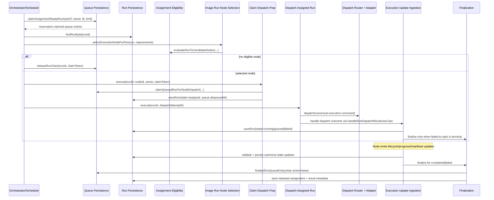

# Run Orchestration Queue, Assignment, and Dispatch Control-Plane Architecture

## Story alignment

- Feature 16: Run Submission and Orchestration Core
- Epic 16.2: Build Queueing, Assignment, and Execution Dispatch Through the Authoritative Control Plane
- Story 16.2.8: Document the queue, assignment, and dispatch architecture for future scheduler integration

## Purpose

Document the implemented end-to-end authoritative orchestration lifecycle across queue selection, node assignment, claim and dispatch preparation, backend dispatch, progress ingestion, and completion/failure finalization so future scheduler-policy work can extend behavior without breaking lifecycle truth.

## Canonical implementation map

- Domain lifecycle and transition legality
  - `src/domain/runs/RunDomain.ts`
- Shared transport contracts and schemas
  - `src/shared/contracts/runtime/RunOrchestrationTransportContracts.ts`
  - `src/shared/schemas/runtime/RunOrchestrationTransportSchemaContracts.ts`
- Queue, assignment, dispatch, update-ingestion, and finalization orchestration
  - `src/application/runs/ports/RunOrchestrationPersistencePorts.ts`
  - `src/application/runs/ports/RunAssignmentEligibilityPorts.ts`
  - `src/application/runs/ports/RunExecutionDispatchPorts.ts`
  - `src/application/nodes/ports/ExecutionNodeManagementPorts.ts`
  - `src/application/runs/use-cases/ProcessQueuedRunDispatchUseCase.ts`
  - `src/application/runs/use-cases/SelectAssignmentReadyRunsUseCase.ts`
  - `src/application/runs/use-cases/RunNodeAssignmentEligibilityService.ts`
  - `src/application/nodes/use-cases/ImageRunNodeEligibilityEvaluationService.ts`
  - `src/application/nodes/use-cases/ImageRunExecutionNodeSelectionService.ts`
  - `src/application/runs/use-cases/ClaimRunForNodeDispatchPreparationUseCase.ts`
  - `src/application/runs/use-cases/BuildAssignedRunExecutionCommandUseCase.ts`
  - `src/application/runs/use-cases/DispatchAssignedRunExecutionUseCase.ts`
  - `src/application/runs/use-cases/HandleRunDispatchResultUseCase.ts`
  - `src/application/runs/use-cases/IngestRunExecutionUpdateUseCase.ts`
  - `src/application/runs/use-cases/FinalizeRunExecutionOutcomeUseCase.ts`
- Infrastructure adapters
  - `src/infrastructure/persistence/platform/SqlitePlatformPersistenceAdapter.ts`
  - `src/infrastructure/execution/runs/RunExecutionDispatchRouter.ts`
  - `src/infrastructure/execution/runs/LocalWorkerRunExecutionDispatchAdapter.ts`
  - `src/infrastructure/execution/runs/RemoteRunExecutionDispatchAdapter.ts`
  - `src/infrastructure/execution/runs/ComfyUiRunExecutionDispatchAdapter.ts`
  - `src/infrastructure/api/runs/AuthoritativeRunExecutionUpdateBackendApi.ts`
  - `src/infrastructure/transport/http-server/identity/IdentityHttpServer.ts`

## End-to-end authoritative lifecycle

## Queue and assignment model

1. Queue admission and selection are durable and reservation-backed.
2. `claimAssignmentReadyRuns` is the only supported path for assignment-ready work leasing.
3. Queue ordering is deterministic and persistence-owned (`eligible_at`, `order_key`, `entered_at`, `run_id`).
4. Queue persistence remains scheduling-policy neutral; node capability/policy checks are application-layer concerns.
5. Node-targeted selection uses `IRunNodeAssignmentEligibilityService` and releases claims immediately when eligibility fails.
6. Node-aware dispatch selection uses `IImageRunExecutionNodeSelectionServicePort` and `IImageRunNodeEligibilityEvaluationServicePort` before assignment claim and dispatch preparation.

## Initial queued-to-dispatch orchestration pass

1. `ProcessQueuedRunDispatchUseCase` provides the initial image-slice orchestration pass for `queued` runs.
2. The pass composes `SelectAssignmentReadyRunsUseCase`, `ImageRunExecutionNodeSelectionService`, `ClaimRunForNodeDispatchPreparationUseCase`, and `DispatchAssignedRunExecutionUseCase`.
3. Lifecycle progression remains explicit and durable (`queued` -> `assigned` -> `dispatching` -> `running|failed`) through existing domain-owned transitions.
4. Dispatch linkage is captured through durable dispatch-attempt ids and backend dispatch receipts for later progress/result synchronization.
5. Selection refusal is explicit and structured (`stage=selection` with outcome/reasons/candidate count) when no eligible node can be chosen.
6. Reservation claims are released immediately on selection refusal so runs remain available for later scheduling attempts.
7. Assignment remains single-writer and durable through `ClaimRunForNodeDispatchPreparationUseCase`, which records assigned node id and dispatch-attempt metadata before backend invocation.

## Claim and dispatch model

1. `ClaimRunForNodeDispatchPreparationUseCase` is the authoritative queued-run claim path before dispatch.
2. Claim preconditions are conflict-safe (`claimToken`, `claimedBy`, lease validity, no existing assignment).
3. Successful claim transitions canonical state to `assigned`, persists assignment lineage, and records durable dispatch attempt metadata.
4. Dispatch command building and backend translation are separated:
   - application constructs canonical command
   - infrastructure adapters map command to backend payloads
5. Dispatch result handling is mandatory and authoritative:
   - accepted dispatch transitions run to `running` and releases active scheduling reservation claim ownership
   - retryable failed-to-start outcomes may requeue to `queued` (via retry-pending progression) for scheduler re-evaluation
   - non-requeue failed-to-start outcomes transition run to `failed` and finalize queue/assignment state

## Progress ingestion and finalization model

1. Node updates are ingested through one authoritative use case (`IngestRunExecutionUpdateUseCase`).
2. Ingestion enforces sender-node ownership, non-terminal updateability, and backend identity consistency.
3. User-safe progress and status fields are persisted in canonical run state.
4. Internal diagnostics are persisted in metadata telemetry only and not projected in standard run read envelopes.
5. Completion/failure finalization is centralized:
   - assignment is released with lineage preserved
   - queue entry is finalized and active claims are cleared
   - result summary is stored in `metadata.orchestration.finalization`
   - internal finalization diagnostics stay under `metadata.executionTelemetry`

## Scheduling-policy boundary and extension points

Scheduling evolution should compose around these existing seams:

- Work retrieval and lease lifecycle: `IRunOrchestrationQueuePersistenceRepository`
- Node eligibility rules and policy checks: `IRunNodeAssignmentEligibilityService`, `IRunAssignmentPolicyPort`
- Scheduler-side scoring and prioritization: orchestration service above queue repository (not inside transport handlers or adapters)
- Dispatch backend expansion: `IRunExecutionBackendAdapter` registrations in `RunExecutionDispatchRouter`

Required boundary rule:
- Scheduling policy selects *which claimed run/node pair to attempt next*.
- Dispatch orchestration executes *how an already-assigned run is translated and sent to a backend*.

Do not merge these responsibilities into one adapter or transport endpoint.

## Invariants future work must preserve

- Canonical lifecycle transition legality is owned by `RunDomain` only.
- Queue claim lease fields (`claimToken`, `claimedBy`, `claimExpiresAt`) are authoritative for reservation ownership.
- Node assignment must be single-writer conflict-safe (`already-assigned` and reservation/queue conflicts are first-class outcomes).
- Node-selection refusal must surface structured reason payloads and must release queue claims before returning.
- Dispatch-attempt history is durable and linked to run + queue + reservation metadata.
- Terminal completion/failure must clear active queue claim state and release active assignment ownership.
- User-safe and internal diagnostics must remain separated in persistence and projection surfaces.
- Node execution updates must be rejected when sender identity does not match authoritative assignment.

## Prohibited shortcuts

- Writing assignment, claim, dispatch-attempt, or lifecycle state directly from transport handlers is prohibited.
- Bypassing `ClaimRunForNodeDispatchPreparationUseCase` before dispatch is prohibited.
- Calling backend dispatch adapters without `BuildAssignedRunExecutionCommandUseCase` is prohibited.
- Applying progress/lifecycle updates without `IngestRunExecutionUpdateUseCase` validation is prohibited.
- Re-implementing lifecycle transition legality outside `src/domain/runs/RunDomain.ts` is prohibited.
- Leaking internal diagnostics into user-facing run summary/detail/status contracts is prohibited.

## Verification baseline

- Queue and assignment-ready selection:
  - `src/application/runs/tests/SelectAssignmentReadyRunsUseCase.test.ts`
  - `src/application/runs/tests/RunNodeAssignmentEligibilityService.test.ts`
- Node claim and dispatch preparation:
  - `src/application/runs/tests/ClaimRunForNodeDispatchPreparationUseCase.test.ts`
- Command build and dispatch:
  - `src/application/runs/tests/BuildAssignedRunExecutionCommandUseCase.test.ts`
  - `src/application/runs/tests/DispatchAssignedRunExecutionUseCase.test.ts`
  - `src/infrastructure/execution/tests/RunExecutionDispatchAdapters.contract.test.ts`
- Dispatch result state progression:
  - `src/application/runs/tests/HandleRunDispatchResultUseCase.test.ts`
  - `src/application/runs/tests/RunDispatchResultStateTransitions.test.ts`
- Progress ingestion and finalization:
  - `src/application/runs/tests/IngestRunExecutionUpdateUseCase.test.ts`
  - `src/infrastructure/api/runs/tests/AuthoritativeRunExecutionUpdateBackendApi.test.ts`
  - `src/infrastructure/transport/http-server/identity/tests/IdentityHttpServerAuthoritativeRunExecutionUpdateApi.test.ts`
  - `src/infrastructure/persistence/platform/tests/SqlitePlatformPersistenceAdapter.test.ts`
- End-to-end lifecycle regression and recovery hardening:
  - `src/application/runs/tests/RunOrchestrationLifecycleRegression.integration.test.ts`

## Story 16.3.8 hardening status

- Representative integration coverage now exercises submission, queue admission, assignment selection, node claim, dispatch acceptance, progress updates, completion finalization, policy-checked cancellation/retry outcomes, startup recovery, and read-surface contract parsing.
- Cross-layer drift checks now include schema-level parsing of list, queue-status, and status-envelope projections produced by authoritative orchestration query APIs.
- Duplicate assignment prevention remains conflict-driven at claim time (`already-assigned`) and is asserted in regression coverage.

## Explicit deferred edges

- Scheduler scoring/prioritization policy remains intentionally minimal; queue persistence and reservation semantics are stable, but advanced policy tuning is deferred to subsequent scheduling work.
- Automatic recovery remains guarded to safe cases (expired claims, stale assignment/running windows, persisted dispatch reconciliation). Broader autonomous remediation remains manual-follow-up by design.
- Realtime event delivery is contract-stable but intentionally bounded to user-safe orchestration signals; expanded operator-only event families remain deferred until policy/audience expansion work.
