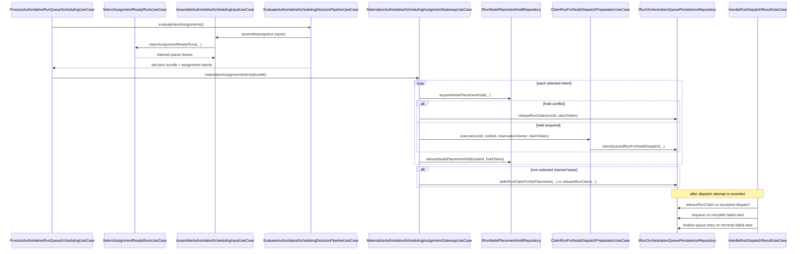

# Scheduling Integration for Authoritative Queue Selection and Assignment

## Story alignment

- Feature 17: Policy-Aware Scheduling and Hybrid Node Arbitration
- Epic 17.2: Integrate Scheduling Decisions with Queue Processing, Node Arbitration, and Reservation Controls
- Story 17.2.1: Integrate the scheduler into authoritative queue selection and assignment flow
- Story 17.2.8: Document queue integration, reservations, arbitration behavior, and dispatch outcome seams for future capacity work

## Purpose

Make scheduling policy decisions the authoritative path for queue processing and assignment materialization so queue claim traversal, policy evaluation, and node-assignment claim finalization execute through one explicit orchestration flow.

## Canonical implementation map

- Scheduling input assembly from claimed queue work, runs, nodes, and role context:
  - `src/application/scheduling/use-cases/AssembleAuthoritativeSchedulingInputUseCase.ts`
- Scheduling decision pipeline and policy evaluator:
  - `src/application/scheduling/use-cases/EvaluateAuthoritativeSchedulingDecisionPipelineUseCase.ts`
  - `src/application/scheduling/use-cases/EvaluateAuthoritativeSchedulingPolicyUseCase.ts`
- Assignment materialization gateway:
  - `src/application/runs/use-cases/MaterializeAuthoritativeSchedulingAssignmentGatewayUseCase.ts`
- Temporary node-placement hold seam used during assignment materialization:
  - `src/application/runs/ports/RunOrchestrationPersistencePorts.ts` (`IRunNodePlacementHoldRepository`)
  - `src/infrastructure/persistence/platform/SqlitePlatformPersistenceAdapter.ts`
- Authoritative queue scheduling orchestration entry point:
  - `src/application/runs/use-cases/ProcessAuthoritativeRunQueueSchedulingUseCase.ts`
- Dispatch outcome settlement that returns queue ownership to scheduling or finalization:
  - `src/application/runs/use-cases/HandleRunDispatchResultUseCase.ts`
- Existing queue claim/assignment invariants preserved through:
  - `src/application/runs/use-cases/SelectAssignmentReadyRunsUseCase.ts`
  - `src/application/runs/use-cases/ClaimRunForNodeDispatchPreparationUseCase.ts`

## End-to-end scheduling, reservation, and dispatch settlement flow

## Authoritative control flow

1. Claim assignment-ready queue leases via `SelectAssignmentReadyRunsUseCase`.
2. Assemble `SchedulingEvaluationSnapshot` using claimed leases, canonical run requirements, trusted node inventory, workspace role context, and optional node policy-state overlays.
3. Evaluate scheduling policy through `EvaluateAuthoritativeSchedulingDecisionPipelineUseCase`.
4. Materialize only scheduler-selected intents by:
   - releasing non-selected queue claims
   - deferring no-placement runs with explicit reason/backoff metadata when persistence supports `deferRunClaimForNoPlacement`
   - acquiring short-lived node placement holds before node claim finalization
   - finalizing selected assignment through `ClaimRunForNodeDispatchPreparationUseCase`
   - releasing temporary placement holds after claim attempt completion
5. Route dispatch outcomes through `HandleRunDispatchResultUseCase` so reservation ownership is explicitly released, requeued, or finalized.
6. Return decision bundle plus materialized intents for downstream dispatch preparation/execution stages.

## Preserved invariants

- Queue traversal and lease claims still originate from authoritative queue repository semantics.
- Policy evaluation remains isolated from dispatch adapter execution.
- Final node assignment still requires reservation-backed claim token ownership.
- Conflict outcomes remain controlled and explicit (`already-assigned`, reservation conflict, not found).
- Assignment materialization now guards selected node targets with expiring placement holds to reduce duplicate node placement races.
- Non-selected queue claims are explicitly released; no hidden bypass paths remain.
- No-placement outcomes are explicit and reason-bearing (`deferRunClaimForNoPlacement` metadata or explicit release fallback).
- Placement holds are always released after claim attempt completion (success or conflict).
- Dispatch outcomes are queue-settlement explicit: accepted dispatch releases reservation ownership; retryable failed-start can requeue; terminal failed-start finalizes.

## Boundary posture

- Scheduling decides *which* claimed run/node pair should be materialized.
- Assignment materialization applies authoritative claim transitions.
- Dispatch execution remains downstream and separate from scheduling decisions.
- Dispatch result handling settles queue reservation and retry/finalization posture without bypassing scheduler/claim contracts.

Do not collapse scheduling and backend dispatch logic into one module or transport path.

## Future capacity and reservation-policy extension map

Use these seams for capacity, quota, reservation-window, or richer resource-arbitration policy additions:

1. Queue leasing and reservation ownership:
   - `SelectAssignmentReadyRunsUseCase`
   - `IRunOrchestrationQueuePersistenceRepository`
2. Scheduling policy scoring/arbitration:
   - `src/application/scheduling/use-cases/SchedulingPolicyRulePipeline.ts`
   - `src/application/scheduling/use-cases/RolePrioritySchedulingArbitration.ts`
3. Node placement and reservation holds:
   - `MaterializeAuthoritativeSchedulingAssignmentGatewayUseCase`
   - `IRunNodePlacementHoldRepository`
4. Dispatch outcome reservation settlement:
   - `HandleRunDispatchResultUseCase`

Do not implement capacity/quota rules by mutating queue state directly in transport handlers, dispatch adapters, or persistence schema helpers.

## Verification baseline

- `src/application/scheduling/tests/AssembleAuthoritativeSchedulingInputUseCase.test.ts`
- `src/application/runs/tests/ProcessAuthoritativeRunQueueSchedulingUseCase.integration.test.ts`
- `src/application/runs/tests/MaterializeAuthoritativeSchedulingAssignmentGatewayUseCase.test.ts`
- `src/application/runs/tests/HandleRunDispatchResultUseCase.test.ts`
- `src/infrastructure/persistence/platform/tests/SqlitePlatformPersistenceAdapter.test.ts`

